## HTML

* 超文本标记语言 不是编程语言 告诉浏览器如何构造网页。

* ```html
  属性
  <a herf="">文字</a>  点击文字跳转到herf上的连接
  <a herf="" target="_blank"> 文字1 </a>  新开一个链接老连接还在 
                            
                 
  ```
  
  填充文本
  
  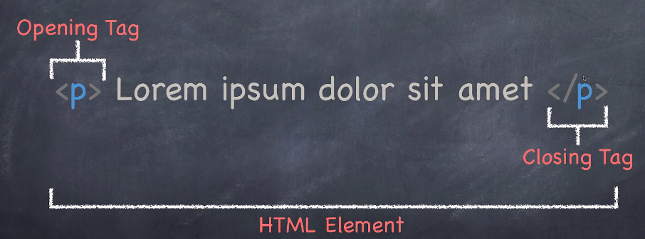
  
  

head存放不被浏览器渲染的东西  body存放给用户看到的东西

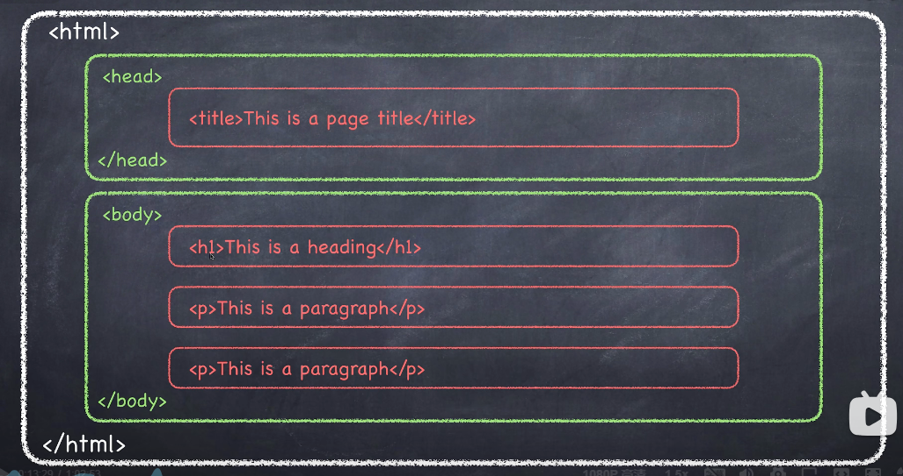

* <head>并不会被渲染 只有标题显示

  * ```html
    <!DOCTYPE html>
    <html>
        <head>
            <title>hello</title>
        </head>
        
        <body>
            
        </body>
        
    </html>
    
    ```
    
    
  
  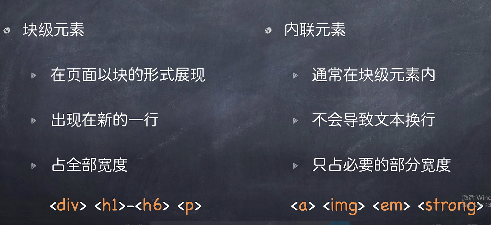


* 属性

   被写在起始的tag上面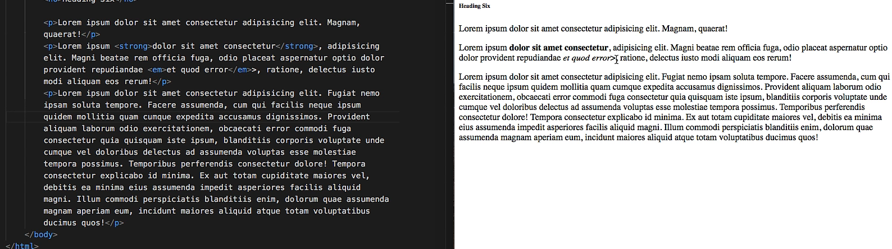


有序列表 无需列表 和表格 


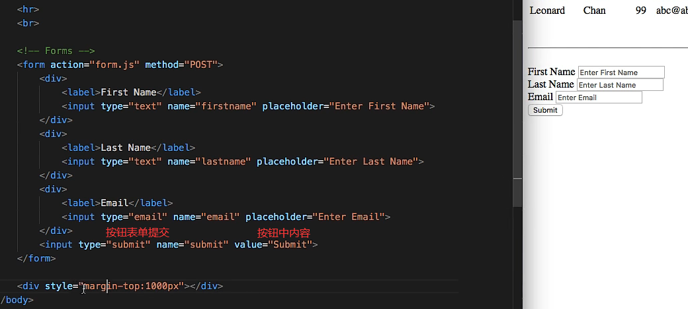

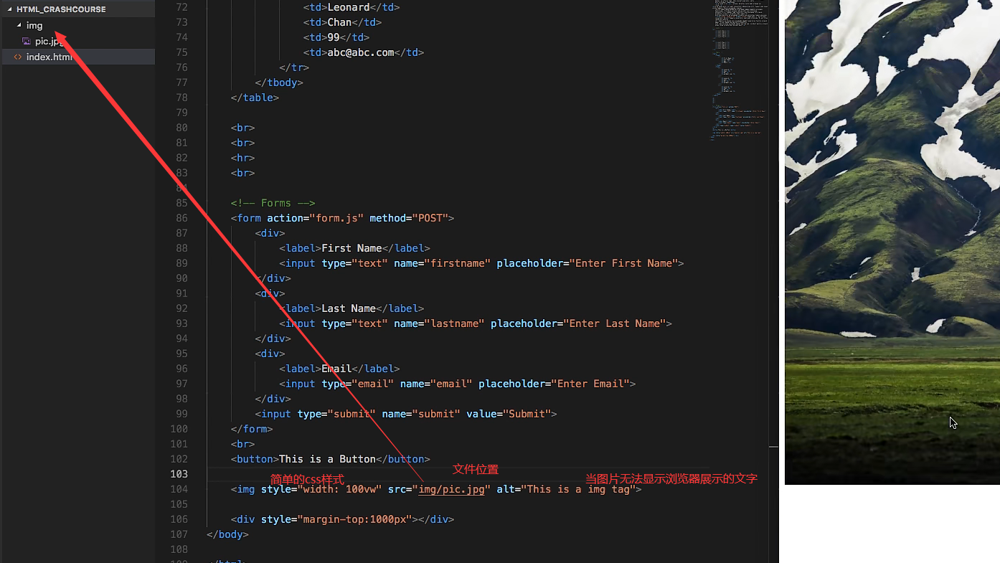

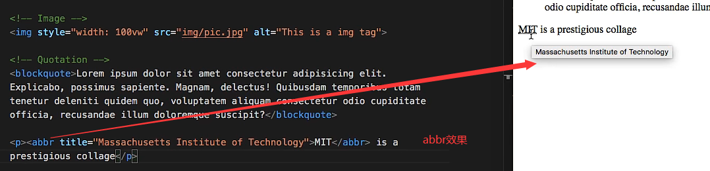


## css

### 基础

* 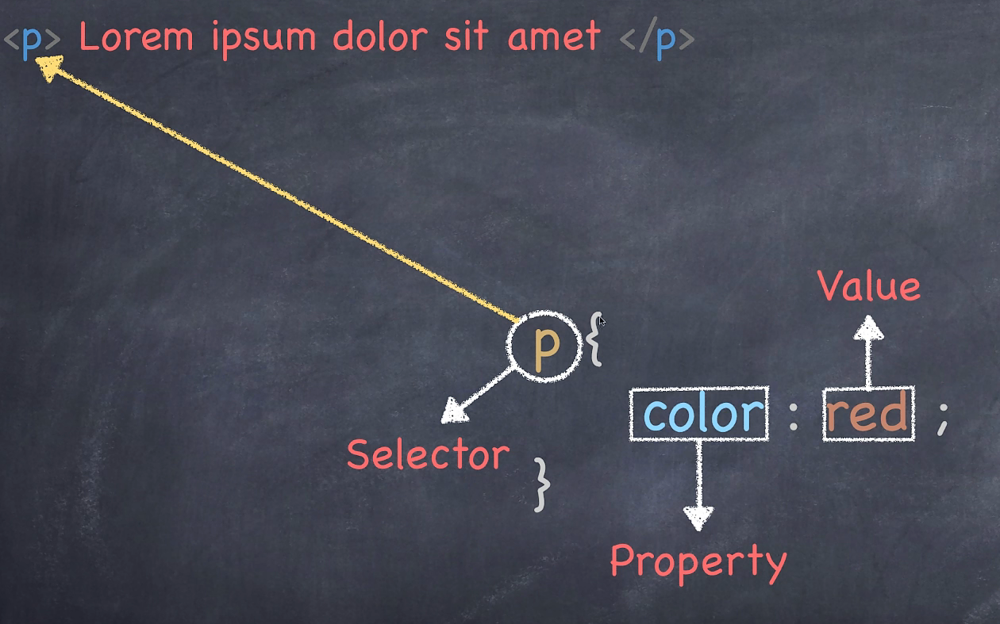

* 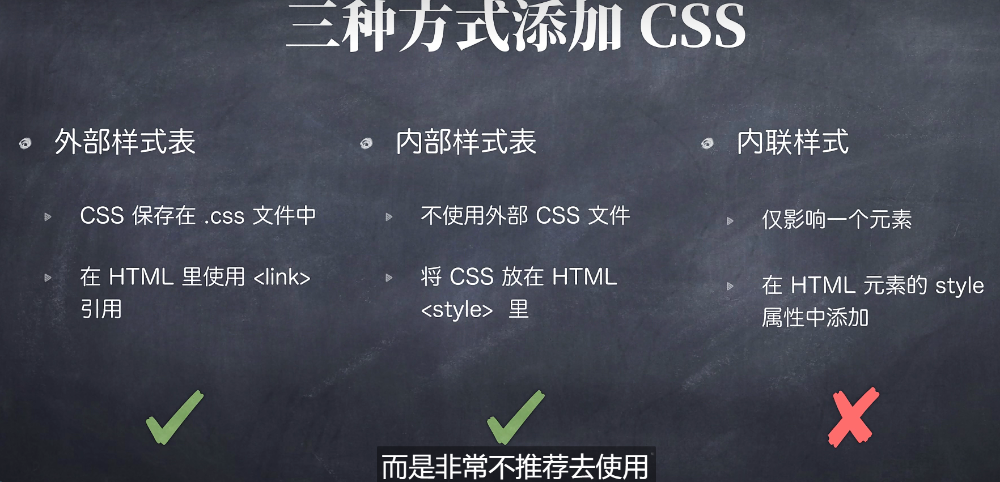

* 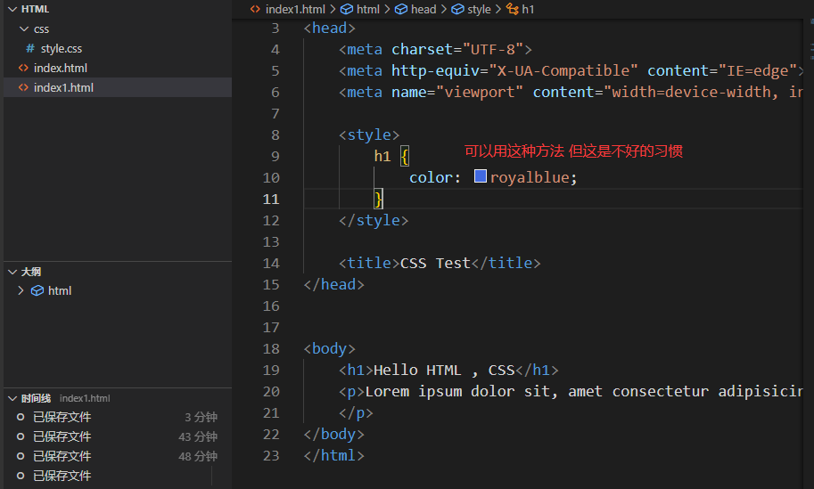

* 三种选择器

  
  
* 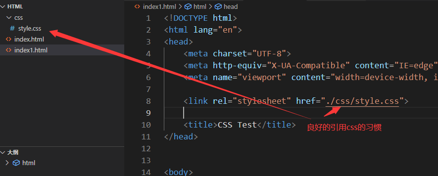

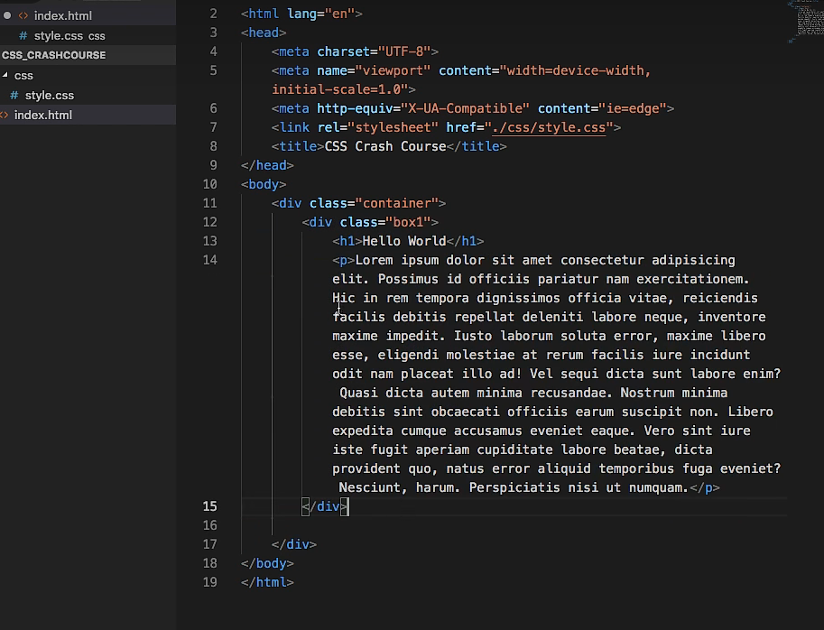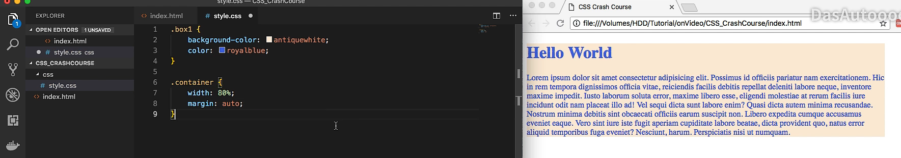

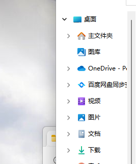

